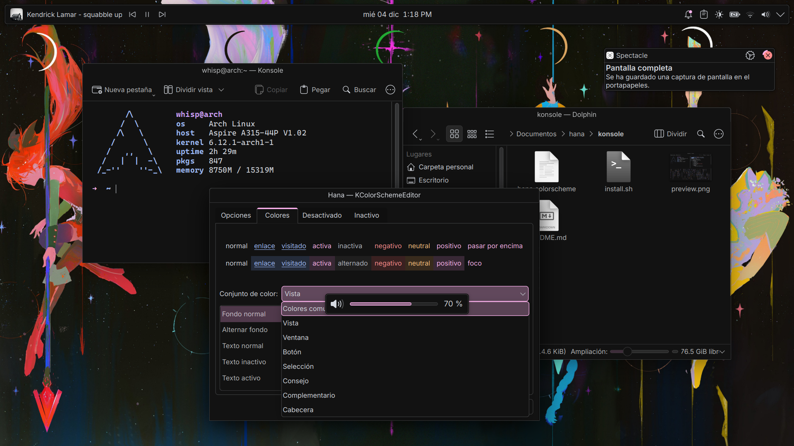

    
    <h3>
        hana for kde
    </h3>
    <em>
        "hana" (花) — japanese for "flower", a symbol of fleeting beauty
    </em>

## preview

## install

in order to install hana as a color scheme in your kde system, simply download
the `.colors` file and install it through the system settings app

if you prefer to install it manually, you can do so by copying the `.colors`
file to your local `~/.local/share/color-schemes/` directory

## requirements

this color scheme was made with and tested using kde plasma 6. while
compatibility for plasma 5 has not been tested, it *may* work. however, they
arent oficially supported