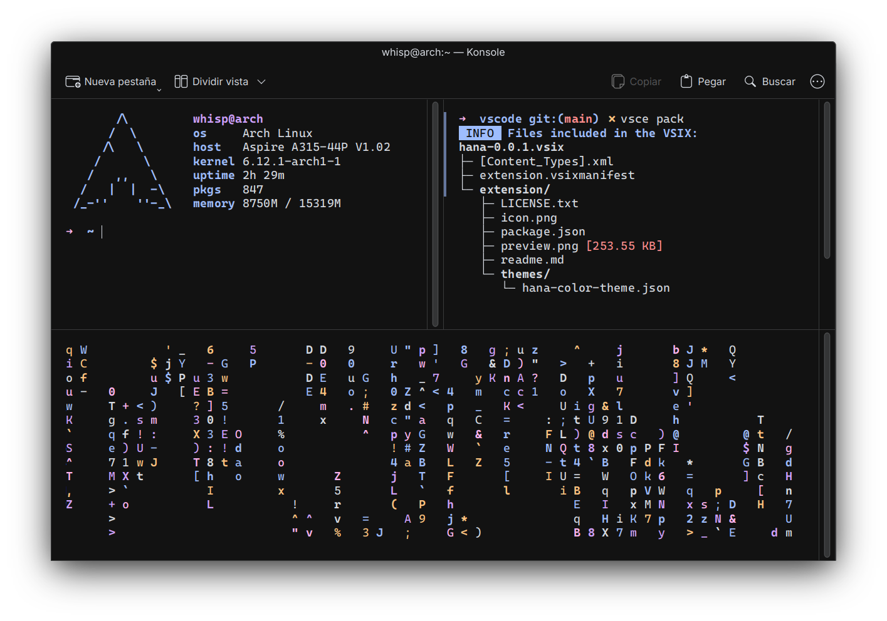

    
    <h3>
        hana for konsole
    </h3>
    <em>
        "hana" (花) — japanese for "flower", a symbol of fleeting beauty
    </em>

## preview

## installation instructions
download the `.colorscheme` file from this folder and place it under
`~/.local/share/konsole/`. after doing so, the color scheme will be available to
choose from your profile preferences

## requirements

this color scheme was made with and tested using kde plasma 6. while
compatibility for plasma 5 and older konsole versions has not been tested, it
*may* work. however, they arent oficially supported