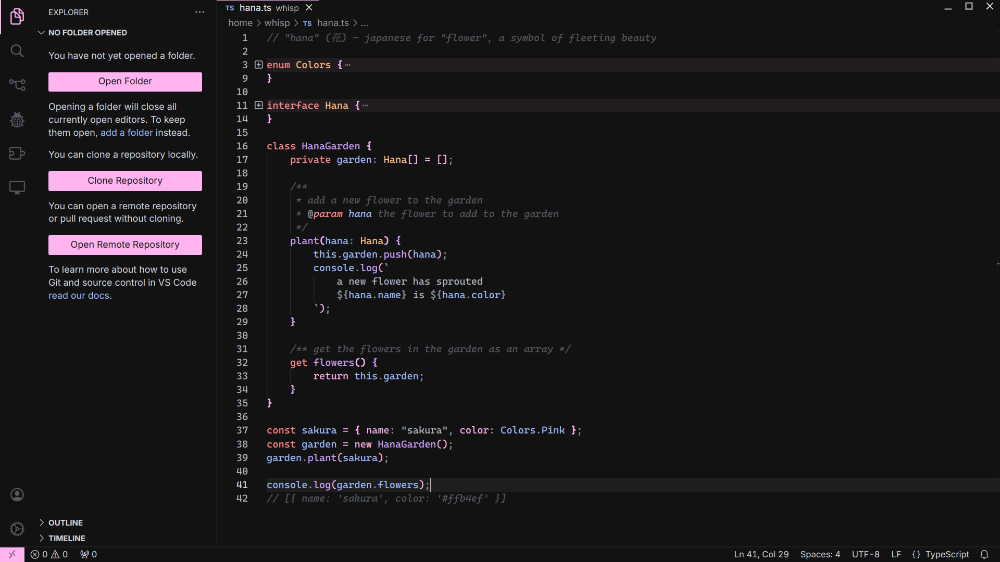

    
    <h3>
        hana for vscode
    </h3>
    <em>
        "hana" (花) — japanese for "flower", a symbol of fleeting beauty
    </em>

## preview

## installation

~~hana for vscode can be downloaded from the vscode marketplace~~ soon™

## install manually

### prerequisites

- the `vsce` npm package should be previously installed in your system. to do
so, run `npm install -g @vscode/vsce`

if you wish to manually install the theme yourself. after cloning the
repository, simply run `vsce package`, which will package the extension in a
vsix file you can later install